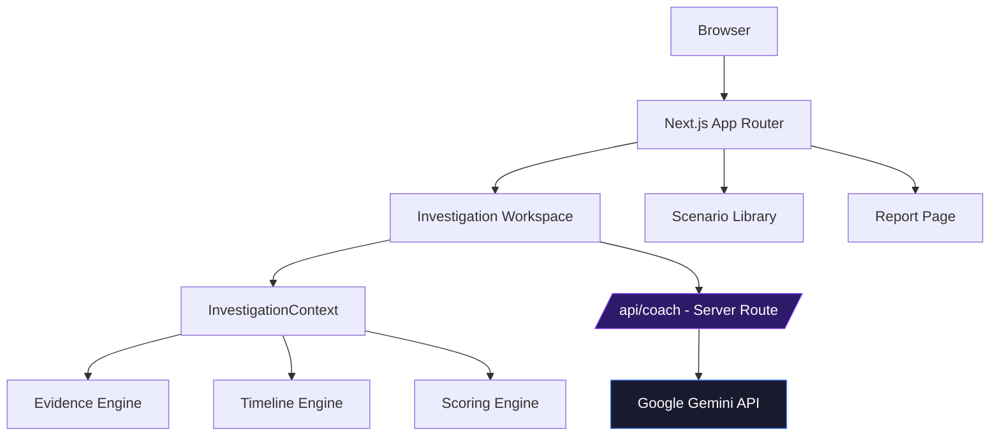
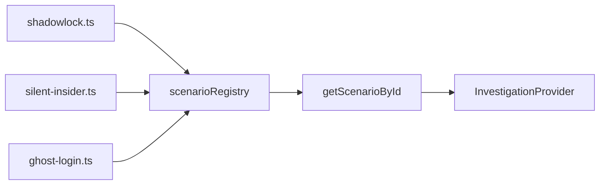
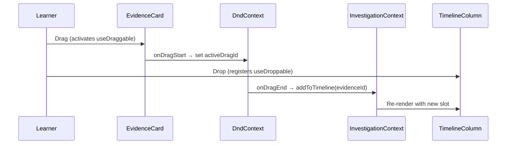
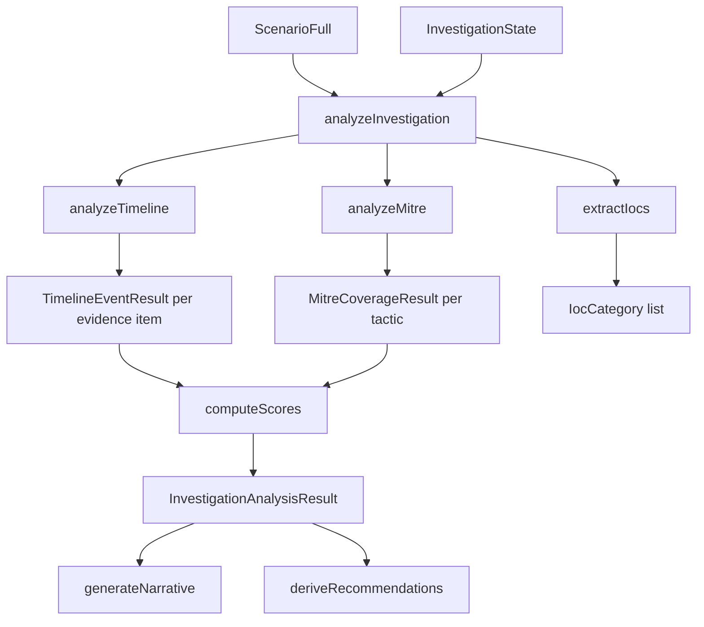
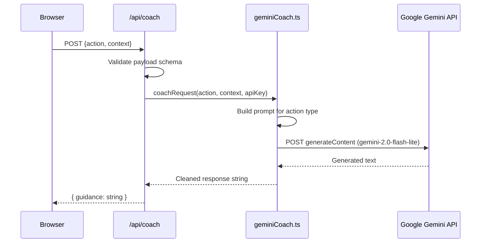
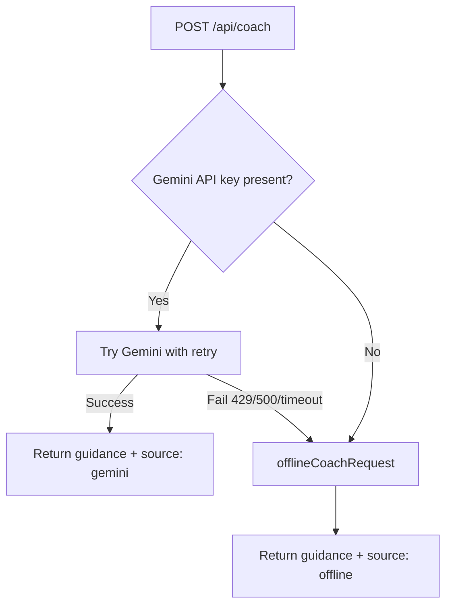
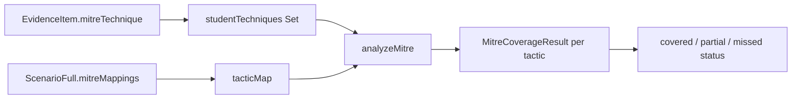
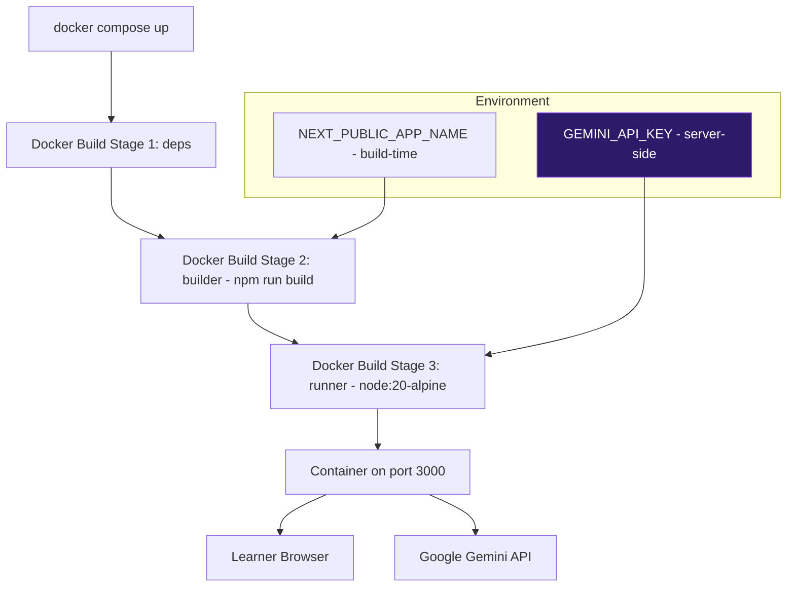

# TraceForge AI — Architecture

> Technical architecture reference for the TraceForge AI DFIR learning platform.

---

## 1. System Overview

TraceForge AI is a **browser-native**, **server-assisted** Next.js application. All investigation logic (scoring, IOC extraction, narrative generation) runs client-side in the browser. Only the AI Coach communicates with an external service — exclusively through a server-side API route that keeps the Gemini API key out of the client bundle.



---

## 2. Engine Subsystems

### 2.1 Scenario Engine

**Location:** `src/data/scenarios/`

The Scenario Engine loads structured TypeScript data files into a central registry. Each scenario file implements the `ScenarioFull` interface, providing all evidence, MITRE mappings, recommendations, and learning objectives.



**Adding a scenario:** Create a new TypeScript file, implement `ScenarioFull`, and register it in `src/data/scenarios/index.ts`. No other changes required.

**Key types:**
```typescript
ScenarioFull extends Scenario {
  investigationBrief: string
  learningObjectives: LearningObjective[]
  evidence: EvidenceItem[]        // shuffled at session start
  mitreMappings: MitreMappingEntry[]
  recommendations: ScenarioRecommendation[]
  riskLevel: number
}
```

---

### 2.2 Evidence Engine

**Location:** `src/components/features/evidence/EvidenceWorkspace.tsx`

Evidence cards are rendered from the scenario's `evidence` array. The workspace supports filtering by:
- Severity (low / medium / high / critical)
- Category (Log / Network / Artifact / Memory / Registry)
- MITRE tactic
- Free-text search

Each `EvidenceItem` carries:

| Field | Purpose |
|---|---|
| `id` | Unique identifier (used for drag operations) |
| `title` | Short display title |
| `timestamp` | ISO-8601 timestamp (used for canonical ordering) |
| `source` | Source system label |
| `severity` | low / medium / high / critical |
| `mitreTactic` | Mapped tactic string |
| `mitreTechnique` | ATT&CK technique ID (e.g. `T1059.001`) |
| `rawLog` | Full raw log excerpt |
| `iocType` / `iocValue` | Primary indicator of compromise |

---

### 2.3 Timeline Engine

**Location:** `src/contexts/InvestigationContext.tsx`, `src/components/features/investigation/TimelineColumn.tsx`

The Timeline Engine manages the learner's ordered list of `TimelineSlot` objects. A slot maps a unique `slotId` to an `evidenceId`, allowing the same evidence to appear multiple times.



State is persisted to `localStorage` under `traceforge:investigation:{scenarioId}`, enabling session recovery.

---

### 2.4 Rule-based Scoring Engine

**Location:** `src/lib/investigationAnalysis.ts`

The scoring engine runs entirely client-side. It produces a deterministic `InvestigationAnalysisResult` from the `ScenarioFull` ground truth and the learner's `InvestigationState`.



**Scoring weights:**

| Component | Weight |
|---|---|
| Timeline Accuracy | 35% |
| MITRE / Threat Coverage | 35% |
| IOC Recognition | 15% |
| Investigation Completeness | 15% |

**Timeline scoring logic:**
- Correct position: full credit
- ±1 position tolerance: full credit (near-correct)
- More than ±1 positions off: out-of-order (0.5 credit)
- Not placed: missed (0 credit)

---

### 2.5 AI Coach Flow

**Location:** `src/lib/geminiCoach.ts`, `src/app/api/coach/route.ts`, `src/components/features/coach/AICoach.tsx`

The AI Coach enforces a strict data flow to ensure the API key never reaches the browser.



**Four supported actions:**

| Action | Prompt strategy |
|---|---|
| `hint` | Investigative question + type of evidence to seek |
| `explain-evidence` | Forensic meaning + MITRE mapping + correlated evidence types |
| `next-step` | Gap analysis based on current timeline + reviewed evidence |
| `explain-mistakes` | Educational feedback post-submission, never reveals correct order |

**Mentor rules enforced in system prompt:**
- Never say "the answer is..."
- Never reveal the canonical timeline order
- Never reveal hidden evidence items
- Always ask investigative questions
- Always reference MITRE ATT&CK

---

### 2.6 Offline DFIR Mentor Fallback

**Location:** `src/lib/offlineCoach.ts`

When Gemini is unavailable (rate limit, network failure, missing key), the API route silently falls back to the Offline DFIR Mentor — a fully rule-based engine that requires no API calls.



The offline mentor uses attack-type phase maps, MITRE tactic question banks, and the student's investigation progress to generate educational guidance. The UI shows a labelled badge (Gemini Mentor / Offline Mentor) with no error state — the transition is transparent to the learner.

---

### 2.6 MITRE ATT&CK Integration

**Location:** Embedded in scenario data + `src/components/features/mitre/MitrePlaceholder.tsx`

Each `EvidenceItem` carries a `mitreTactic` and `mitreTechnique`. The `ScenarioFull.mitreMappings` array defines all techniques the scenario exercises. The scoring engine maps learner-reviewed techniques against this list to compute MITRE coverage.



---

### 2.7 Incident Report Generation

**Location:** `src/app/report/page.tsx`

The report page assembles a structured DFIR incident report. In the current release it renders a styled preview within the browser. The architecture is designed to wire into the scoring engine output in the next release.

**Report sections:**
- Executive Summary
- Attack Timeline
- MITRE ATT&CK Mapping
- Risk Score (0–100 with severity bands)
- Recommendations

**Risk level mapping:**

| Score | Risk Level |
|---|---|
| 90–100 | Low |
| 75–89 | Medium |
| 50–74 | High |
| 0–49 | Critical |

---

## 3. State Management

All investigation state is managed by a single React context provider (`InvestigationContext`) that wraps the investigation page.

```mermaid
flowchart TD
    A[InvestigationProvider] --> B[scenario: ScenarioFull]
    A --> C[invState: InvestigationState]
    A --> D[drawer: DrawerState]
    A --> E[showReview: boolean]
    C --> F[timeline: TimelineSlot[]]
    C --> G[reviewedEvidenceIds: string[]]
    C --> H[notes: Record<string, string>]
    C --> I[localStorage persistence]
```

The `progressStats` computed value derives a single 0–100 progress percentage blending reviewed evidence (50%), timeline placement (30%), and notes written (20%).

---

## 4. Data Flow Summary

```mermaid
flowchart LR
    A[URL ?id=shadowlock] --> B[loadScenario]
    B --> C[ScenarioFull from registry]
    C --> D[EvidenceWorkspace renders cards]
    D --> E[Learner drags / clicks]
    E --> F[InvestigationState updates]
    F --> G[localStorage save]
    F --> H[progressStats recompute]
    H --> I[Status bar update]
    F --> J[openReview trigger]
    J --> K[analyzeInvestigation]
    K --> L[InvestigationReview overlay]
    L --> M[/api/coach for AI feedback]
```

---

## 5. Deployment Architecture



**Multi-stage build benefits:**
- Stage 1 (`deps`): Caches `node_modules` separately — rebuild only when `package.json` changes
- Stage 2 (`builder`): Runs `next build` — produces `.next/standalone` output
- Stage 3 (`runner`): Copies only the standalone bundle into a minimal Alpine image — final image ~200MB

---

## 6. Security Model

| Concern | Implementation |
|---|---|
| API key exposure | `GEMINI_API_KEY` read only in server-side `route.ts`, never bundled |
| Input validation | Route validates all request fields before forwarding to Gemini |
| XSS | All dynamic content rendered via React (escaped by default) |
| Secrets in logs | API key never logged or returned in responses |
| Container security | Runs as non-root user (`nextjs:nodejs`) |
| `.env` files | Excluded from version control via `.gitignore` |

---

## 7. Directory Conventions

| Pattern | Convention |
|---|---|
| `src/app/` | Next.js App Router pages and API routes |
| `src/components/features/` | Feature-specific components, co-located with their domain |
| `src/components/` root | Shared primitives (GlassCard, GradientButton, Navbar) |
| `src/contexts/` | React context providers |
| `src/data/` | Static scenario data files |
| `src/lib/` | Pure service functions (no React, no UI) |
| `src/types/` | Shared TypeScript types |
| `src/utils/` | Pure utility/formatter functions |
