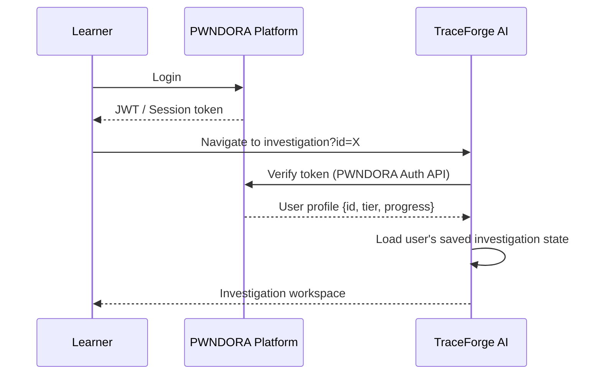

# TraceForge AI — PWNDORA Integration Guide

> How TraceForge AI integrates with the PWNDORA cybersecurity training platform.

---

## 1. Overview

TraceForge AI is designed from the ground up as a native learning module within the PWNDORA ecosystem. It delivers a hands-on DFIR investigation experience that complements PWNDORA's broader curriculum of offensive security, CTF challenges, and defensive techniques.

```
PWNDORA Platform
├── Offensive Labs          (existing)
├── CTF Challenges          (existing)
├── Defensive Modules
│   └── TraceForge AI  ←   DFIR Investigation Module (this project)
└── Learning Pathways
```

---

## 2. Why Browser-Native Learning Matters

Traditional DFIR training requires expensive tooling: SIEM platforms, forensic workstations, isolated lab environments. This creates a barrier for learners who cannot afford or configure these tools.

TraceForge AI removes that barrier entirely:

| Traditional Lab | TraceForge AI |
|---|---|
| Requires SIEM license | Runs in any browser |
| Complex VM setup | Zero installation |
| Static pre-recorded scenarios | Data-driven, extensible scenarios |
| Manual grading | Objective rule-based + AI scoring |
| No personalised feedback | AI mentor explains every mistake |

Browser-native delivery means any PWNDORA learner — regardless of hardware or environment — can practice real DFIR methodology at zero setup cost.

---

## 3. Alignment with PWNDORA Learning Objectives

| PWNDORA Goal | TraceForge AI Contribution |
|---|---|
| Practical skill building | Drag-and-drop timeline reconstruction mirrors real analyst workflow |
| Structured frameworks | MITRE ATT&CK mapping enforces industry-standard taxonomy |
| Immediate feedback | Rule-based scoring + AI Coach deliver feedback within seconds |
| Progressive difficulty | Beginner → Intermediate → Advanced → Expert scenario tiers |
| Portfolio evidence | Downloadable incident reports learners can showcase |

---

## 4. Adding New Scenarios

TraceForge AI is fully data-driven. No application code changes are required to add scenarios.

### Steps to add a scenario

1. **Create the scenario file:**
   ```
   src/data/scenarios/your-scenario-name.ts
   ```

2. **Implement the `ScenarioFull` interface:**
   ```typescript
   import { ScenarioFull } from "@/types";

   export const yourScenario: ScenarioFull = {
     id: "your-scenario-id",
     title: "Operation [Codename]",
     codename: "Operation [Codename]",
     attackType: "Ransomware",        // or Insider Threat, etc.
     difficulty: "Intermediate",
     // ... evidence array, mitreMappings, recommendations
   };
   ```

3. **Register it in the index:**
   ```typescript
   // src/data/scenarios/index.ts
   import { yourScenario } from "./your-scenario-name";

   export const scenarioRegistry: Record<string, ScenarioFull> = {
     [shadowlock.id]: shadowlock,
     [yourScenario.id]: yourScenario,  // ← add here
   };
   ```

4. **Navigate to it:**
   ```
   /investigation?id=your-scenario-id
   ```

PWNDORA scenario authors need no knowledge of React, Next.js, or application internals — only the TypeScript data schema.

---

## 5. How the AI Coach Complements DFIR Learning

The AI Coach implements a deliberate pedagogical design: it behaves as a **Socratic mentor**, never as an answer engine.

### Pedagogical Principles

```
Traditional e-learning:
  Learner makes mistake → System shows correct answer → Learner moves on

TraceForge AI Coach:
  Learner makes mistake → Coach asks a question → Learner thinks → Learner discovers insight
```

This design is grounded in the spacing effect and retrieval practice — learning retained through effort is far more durable than learning handed to the learner.

### Four Coaching Modes

| Mode | When triggered | DFIR skill developed |
|---|---|---|
| **Need a Hint** | Learner is stuck | Evidence identification, lateral thinking |
| **Explain this Evidence** | Learner opens a card | Log analysis, source-type recognition, IOC identification |
| **What next?** | Learner asks for direction | Attack chain reasoning, kill-chain methodology |
| **Explain Mistakes** | Post-investigation | Self-reflection, gap analysis, study planning |

### Why Gemini?

- Low latency (< 2 seconds typical response time)
- Strong forensic and cybersecurity knowledge in training data
- 1 million token context window — can handle full scenario context
- Free tier covers educational usage volumes

---

## 6. Current Integration Architecture

TraceForge AI is currently deployed as a standalone Next.js application. It can be embedded within PWNDORA in three ways:

### Option A: iframe Embed (fastest, no code changes)

```html
<iframe
  src="https://traceforge.pwndora.io/investigation?id=shadowlock"
  style="width:100%; height:100vh; border:none;"
  allow="clipboard-write"
/>
```

### Option B: Subdomain Deployment

Deploy TraceForge AI at `traceforge.pwndora.io` and link from PWNDORA's learning path navigation. Shared design tokens ensure visual consistency.

### Option C: Monorepo Integration (recommended long-term)

Merge TraceForge AI into the PWNDORA monorepo as a `/modules/traceforge` package. Share:
- Authentication context
- Design system tokens (Tailwind config)
- User progress API

---

## 7. Authentication Handoff (Future)

When PWNDORA authentication is integrated:



**Required PWNDORA APIs (future):**

| Endpoint | Purpose |
|---|---|
| `GET /api/user/profile` | Retrieve learner tier and completed scenarios |
| `POST /api/progress/update` | Persist investigation scores to learner profile |
| `GET /api/scenarios/available` | Fetch tier-gated scenario list |

---

## 8. Shared Design Tokens

TraceForge AI uses a design language that maps directly to PWNDORA's dark-theme aesthetic:

| Token | Value | Usage |
|---|---|---|
| Background | `#050507` | Page background |
| Panel | `rgba(255,255,255,0.02)` | Glassmorphism cards |
| Accent primary | `#a855f7` (purple-500) | Highlights, badges, rings |
| Accent secondary | `#3b82f6` (blue-500) | Gradients, secondary actions |
| Border | `rgba(255,255,255,0.06)` | Card borders |
| Success | `#10b981` (emerald-500) | Correct placements |
| Warning | `#eab308` (yellow-500) | Out-of-order, in-progress |
| Danger | `#ef4444` (red-500) | Missed events, critical severity |

These tokens are configured in Tailwind CSS and can be synced with PWNDORA's design system with a single configuration update.

---

## 9. Future Roadmap

| Phase | Feature | Priority |
|---|---|---|
| **v1.1** | PWNDORA SSO authentication handoff | High |
| **v1.1** | Progress sync to PWNDORA learner profile | High |
| **v1.2** | Interactive MITRE tactic assignment per card | High |
| **v1.2** | Causal link builder (directed evidence graph) | High |
| **v1.3** | PDF incident report download | Medium |
| **v1.3** | Community scenario library (PWNDORA-hosted) | Medium |
| **v2.0** | Live SOC simulation (real-time event streaming) | Future |
| **v2.0** | Multiplayer investigation mode | Future |
| **v2.0** | AI-generated scenario creation from CVE data | Future |

---

## 10. Contact and Contribution

TraceForge AI is open to scenario contributions from the PWNDORA community. New scenarios should:

- Be based on realistic attack patterns
- Cover at least 6 evidence items across multiple source types
- Map to a minimum of 3 distinct MITRE ATT&CK tactics
- Include recommendations relevant to the attack type

Submit scenarios as pull requests to the TraceForge AI repository following the schema in `src/types/index.ts`.

---

*TraceForge AI — Building the next generation of DFIR analysts, one investigation at a time.*
